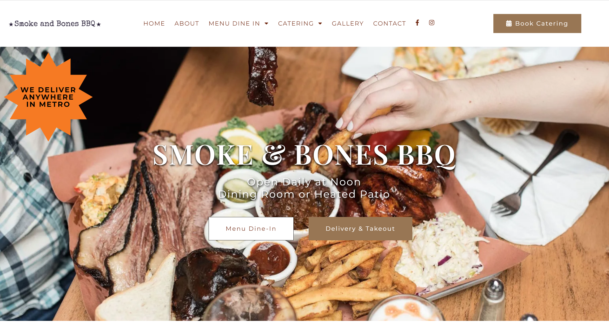
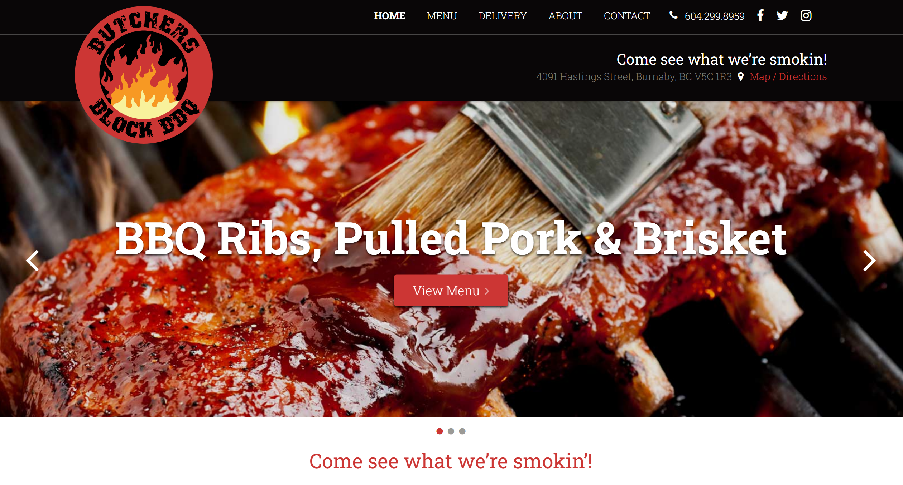

# Project Website Plan

## 1. Project Summary

The purpose of this website is to introduce and promote a barbecue restaurant in the Comox Valley, targeting anyone interested in enjoying barbecue in the area. The site provides essential information, including menu options, pricing, opening hours, and additional services like smoker rentals and custom orders. By showcasing these offerings, the website encourages visitors to book events and subscribe to email updates about upcoming events.

The current website has several areas for improvement: smoker rental and custom order details are split across separate pages, menu information is misplaced, and the homepage photos and layout lack organization, with no background colors to define sections.

**Website URL**: [https://bigbrisketbarbecue.com](https://bigbrisketbarbecue.com)

## 2. Look and Feel

The website should convey a lively and appetizing mood to tempt visitors to try the barbecue offerings. For design inspiration, 
I found two barbecue websites that align well with this concept: [Smoke and Bones BBQ](https://smokeandbones.ca) and [Butcher’s Block BBQ](http://www.butchersblockbbq.com).

### Colors
- **Primary**: `#FED766`
- **Neutral**: `#fffcf0`, `#040706`
- **Highlight**: `#FE4A49`

### Images
Existing logos and photos from the original site will be used. Photos from unplash will be used as well.

### Fonts
Since there are no specific brand typefaces, I plan to use:
- **Headlines**: Playfair Display
- **Body Text**: Roboto

## 3. Website Content

### Home Page

**Header**
- **Logo**
- **Main Navigation**:
  - Home
  - Menu
  - Services

**Hero Section**
- **Heading**: "Indulge in Mouthwatering Smoked Brisket"
- **Paragraph**: "Experience the best Barbecue Brisket in the Comox Valley."
- **Image**: Brisket barbeque image from unplash
- **Button**: "Contact Us" (scrolls down to contact section)

**About Section**
- **Heading**: "About Big Brisket Barbecue"
- **Subheadings**: "What we do?" and "Who are we?"
- **Paragraphs**: Introduction from the original website
- **Images**: Picture of the barbecue and the owner

**Location Section**
- **Heading**: "Location"
- **Content**: Restaurant name, address, and contact number
- **Google Map**: Embedded Google map of the restaurant
- **Table**: Business Hours

**Contact Us Section**
- **Heading**: "Contact Us"
- **Form Inputs**: Name, Email, Description, Attachment
- **Button**: Submit

**Footer**
- **Smaller Logo**
- **Navigation Links**: Home, Menu, Services
- **Copyright Notice**: "Copyright © 2024 Big Brisket Barbecue - All Rights Reserved."
- **Social Media Links**

---

### Menu Page

**Header**
- Same as on the Home Page

**Hero Section**
- **Heading**: "Check out our smoked meat!"
- **Paragraph**: "Done right in our 500-gallon stick burner."
- **Images**: Pictures of the barbecue grill and meats

**Menu Section**
- **Heading**: "Menu"
- **Category Headings**: (e.g., Starters, Mains, Sides)
- **Menu Items**: Name, description, and price for each item

**Footer**
- Same as on the Home Page

---

### Services Page

**Header**
- Same as on the Home Page

**Services Section**
- **Heading**: "What do we provide?"
- **Service Headings**: "Smoker Rental" and "Custom Brisket Orders"
- **Paragraphs**: Descriptions from the original site
- **Images**: Pictures of the barbecue grill and meats

**Contact Us Section**
- **Heading**: "Contact Us"
- **Additional Text**:
  - "Special Requests?"
  - "Do you have an upcoming event that needs some barbecue brisket? Drop us a line, and we'll get back to you soon. Need a special order of smoked brisket on a day other than Saturday? Let us know."
- **Form Inputs**: Name, Email, Description, Attachment
- **Button**: Submit

**Footer**
- Same as on the Home Page
